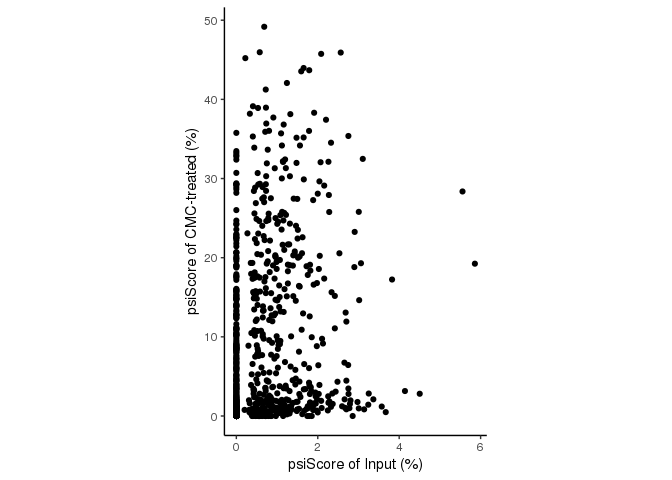
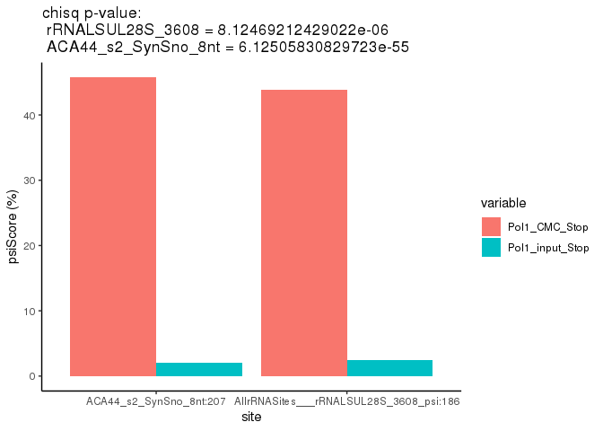

Quantification of pseudouridine at single base resolution
================

## Description of the code

This code quantifies pseudouridine levels at single base resolution. In
short, BAM files are processed by the bam2ReadEnds.R code described in
(DOI: 10.5281/zenodo.3581426; published in Cell: volume 178 pages
731-747 (3)) to form an R object named “countdata” saved as “.Rdata”.
The countdata object holds information on the number of reads starting,
ending and covering each position annotated in the BED file, used as
input for the bam2ReadEnds.R code. The data in the countdata object is
used to calculate psiScores (i.e., level of pseudouridylation) for each
position by dividing the number of reads beginning at the position by
the overall number of reads covering it. The code below processes the
“.Rdata” files found in the working directory to yield a file names
**data\_plots.Rdata** which holds: 1) two dataframes containing
psiScores at each position of each gene annotated in the BED file. 2)
two examplary plots of the analyzed data appearing in the aformentioned
dataframes. The code takes as input the path to the directory holding
the “.Rdata” files.

## General information

The code has been tested using R version 3.6.0. No non-standard hardware
is needed.

R can be downloaded freely and installed in less than 10 minutes on a
“normal” desktop computer.

Running the code on the demo data takes less than 1 minute and initiates
by running the code from the directory where the .Rdata files are found.

## Code

``` r
# dependencies ########################################
library(reshape2)
library(ggplot2)

# upload files ########################################
inDir=getwd()

fList = lapply(1:length(inDir), function(x){
  list.files(inDir[x], pattern=".Rdata",full.names=TRUE)
})

dfList = lapply(1:length(fList), function(f){
  f0 = lapply(1:length(fList[[f]]), function(x){
    f1 = load(fList[[f]][x])
    assign(gsub("Aligned.*|.*/","",fList[[f]][x]), countData)
  })
})

# parse data ##########################################
dfs1 = lapply(1:length(dfList), function(x){
  d1 = lapply(1:length(dfList[[x]]), function(y){
    d3 = as.data.frame(do.call(rbind,lapply(1:length(dfList[[x]][[y]]), function(z){
      d2 = as.data.frame(do.call(cbind, dfList[[x]][[y]][[z]]))
      names(d2) = c("rE5", "rE3", "cov")
      d2$Stop = d2$rE5/d2$cov
      d2$pos = c(1:nrow(d2))
      d2$gene = rep(names(dfList[[x]][[y]][z]), nrow(d2))
      d2$id = paste0(d2$gene, ":", d2$pos)
      d2
    })))
    names(d3) =  c(paste0(gsub(".*/|.Rdata","",fList[[x]])[y],"_",c("rE5", "rE3", "cov", "Stop")), "pos","gene", "id")
    d3
  })
  d4 = Reduce(function(x, y) merge(x, y, all=TRUE, by=c("id","gene","pos")), d1)
})

DF = Reduce(function(x, y) merge(x, y, all=TRUE, by=c("id","gene","pos")), dfs1) # this df has no replicated rows
DF$empty = apply(DF[,grep(".*cov", names(DF), value=T)]==0,1,all,na.rm=T)
DF$type = gsub(".*SynSno_|:.*|___.*","", DF$id)
DF$set = ifelse(grepl("SynSno", DF$id), "synsno", ifelse(grepl("All.*psi", DF$id), "rRNA", ifelse(grepl("Chop", DF$id),"ChoppedrRNA", NA)))

DF$maxCov = apply(DF[,grep("cov", names(DF))], 1, max, na.rm=T)
DF$passCMC = DF$Pol1_CMC_cov-DF$Pol1_CMC_rE5
DF$passInput = DF$Pol1_input_cov - DF$Pol1_input_rE5

# create a dataframe holding only positions of interest #######################################

df = rbind(subset(DF, grepl("^rRNA", set) & pos==186 & !empty)[,!grepl("rE3", names(DF))],
           subset(DF, grepl("synsno", set) & pos==207 & !empty)[,!grepl("rE3", names(DF))])

# add statistics ##############################################################################
df$chisq = unlist(lapply(1:nrow(df), function(x){
  m = matrix(c(df[x,grep("CMC.*rE5", names(df))],df[x,grep("passCMC", names(df))],df[x,grep("input.*rE5", names(df))],df[x,grep("passInput", names(df))]),byrow=TRUE, 2, 2)
  tryCatch({chisq.test(m)$p.value}, error=function(e) {return(NA)})
}))

# parse dataframe for plotting ################################################################
df.melt = melt(df[,grep("id|Stop|chisq", names(df))], id=c("id", "chisq"))

# plots ####################################################################################### 
p1 = ggplot(subset(df, maxCov>100), aes(x= Pol1_input_Stop*100, y=Pol1_CMC_Stop*100))+geom_point()+theme_classic()+coord_fixed(ratio=max(df$Pol1_input_Stop, na.rm=T)/max(df$Pol1_CMC_Stop, na.rm=T))+
  xlab("psiScore of Input (%)")+ylab("psiScore of CMC-treated (%)")

p2 = ggplot(subset(df.melt, id %in% c("AllrRNASites___rRNALSUL28S_3608_psi:186", "ACA44_s2_SynSno_8nt:207")), aes(x= id, y=value*100, fill=variable))+
  geom_bar(stat="identity", position="dodge")+theme_classic()+xlab("site")+ylab("psiScore (%)")+
  ggtitle(paste0("chisq p-value: \n rRNALSUL28S_3608 = ", unique(df.melt[df.melt$id=="AllrRNASites___rRNALSUL28S_3608_psi:186","chisq"]), "\n ACA44_s2_SynSno_8nt = ", unique(df.melt[df.melt$id=="ACA44_s2_SynSno_8nt:207","chisq"])))


save(df, df.melt, p1, p2, file=paste0(inDir,"data_plots.Rdata"))
```

## Plots

Comparison of psiScore of all variants in the transfected library in a
CMC-treated versus an Input sample:

<!-- --> <br><br><br>
Comparison of two specific sites (one in a synthetic construct and one
in a native rRNA fragment) from the transfected library in a CMC-treated
versus an Input sample:

<!-- -->
